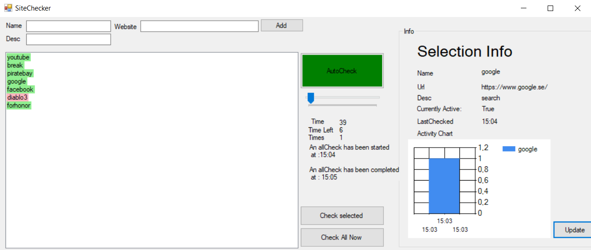

# SiteChecker
A Site checker with autocheck functionallity and display result in chart.

A program that check sites for availability and add the data to a chart.
Can add own sites in the program.

See printscreen below:

